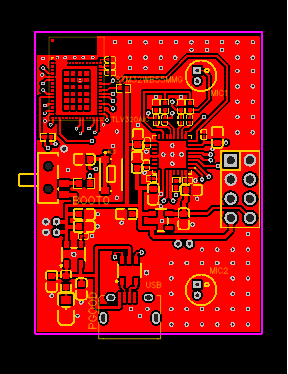
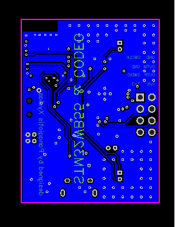

# BLE STM32WB55 PCB Prototype

This repository serves as a sample of PCB design layout for RF-based prototypes utilizing the STM32WB55 chipset. The PCB design is centered around the RF module STM32WB5MMG, adhering to strict PCB design rules to ensure signal integrity and low electromagnetic interference (EMI). Additionally, the PCB integrates a TLV320AIC codec, accommodating 2 electret microphones and driving a single speaker.

## Purpose

The primary objective of this project is to demonstrate a robust PCB layout for RF-based prototypes, specifically targeting the STM32WB55 chipset. The design emphasizes signal integrity and low EMI, critical for reliable RF communication. The integration of the TLV320AIC codec enables audio processing capabilities, enhancing the versatility of potential applications.

## Features

- **RF Module:** Utilizes the STM32WB5MMG chipset for RF communication.
- **TLV320AIC Codec:** Integrates audio processing functionalities, supporting 2 electret microphones and driving a speaker.
- **Bluetooth Connectivity:** Enables communication with a smartphone application via BLE, allowing users to monitor captured signals, adjust volume, and apply filters to the codec's analog input.
- **Versatile Applications:** While the target application includes signal monitoring via a Bluetooth application, the flexibility of the design allows for various other applications based on user needs.

## Usage

As of now, this repository primarily serves as a showcase of PCB layout proficiency and does not include accompanying code. However, interested users can download the design files and order the PCB from JLCPCB.com to explore and experiment with the hardware design.

## Note

Please note that there is currently no direct link to the project. However, you can access the design files in this repository and proceed to order the PCB for further exploration.

Feel free to contribute, provide feedback, or reach out with any inquiries.

## Preview

